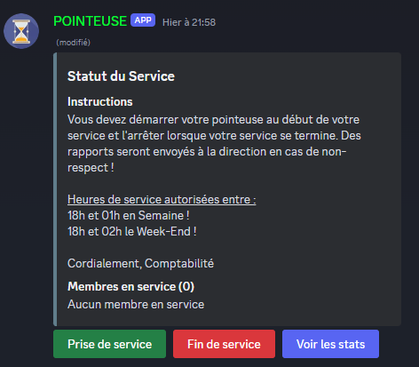

# 🕰️ Discord Pointeuse Bot

[](http://100.93.151.53:9000/dashboard?id=CiscoDerm_FIVE_M_POINTEUSE_98703687-1a61-4931-a971-a522ea079c06)



Le Discord Pointeuse Bot est un outil de gestion du temps de travail pour Discord, permettant aux utilisateurs de commencer et terminer leur service, tout en enregistrant les heures travaillées et en calculant les salaires. Le bot fournit également des statistiques et des alertes pour les services prolongés.

## 🚀 Fonctionnalités

- Prise de service et fin de service
- Enregistrement des heures travaillées
- Calcul des salaires
- Affichage des statistiques personnelles
- Gestion des rôles et des permissions
- Alertes pour les services prolongés
- Envoi des statistiques dans un canal dédié
- Mise à jour automatique des canaux vocaux avec les effectifs en service et total
- Gestion des heures de service autorisées
- Commandes pour les modérateurs et les administrateurs

## 🛠️ Installation

### Prérequis

- Python 3.8+
- pip

### Étapes

1. Clonez le dépôt
   ```bash
   git clone https://github.com/CiscoDerm/FIVE_M_POINTEUSE
   cd pointeuse-bot
   python3 pointeuse.py

3. Installation des dépendences
   ```bash
   discord
   babel   

3. A Changer 
   ```bash
   TOKEN = 'YOUR_BOT_TOKEN'
   ALERT_CHANNEL_ID = 123456789012345678
   STATS_CHANNEL_ID = 123456789012345678
   TOTAL_EFFECTIF_CHANNEL_ID = 123456789012345678
   EN_SERVICE_CHANNEL_ID = 123456789012345678

## 📋 Utilisation

### Commandes Utilisateurs
- Prise de service : Cliquez sur le bouton Prise de service pour commencer votre service.
- Fin de service : Cliquez sur le bouton Fin de service pour terminer votre service.
- Voir les stats : Cliquez sur le bouton Voir les stats pour envoyer vos statistiques dans le canal dédié.

### Commandes Modérateurs
- !cut @utilisateur : Couper le service d'un utilisateur.
- !deduct @utilisateur heures minutes : Soustraire du temps de service à un utilisateur.
- !add @utilisateur heures minutes : Ajouter du temps de service à un utilisateur.
- !set_service_hours jour heure_de_début heure_de_fin : Définir les heures de service autorisées (e.g., !set_service_hours week 18:00 01:00).

### Commandes Administrateurs
- !showlogs : Afficher les logs des services.
- !stats @utilisateur : Afficher les statistiques d'un utilisateur.
- !sumall : Afficher le leaderboard des temps de service.

## 🔄 Mise à jour automatique des canaux
Le bot met à jour automatiquement les canaux vocaux avec les effectifs en service et total toutes les 5 minutes.

## 📅 Vérification des services prolongés
Le bot envoie des alertes pour les services prolongés toutes les 10 minutes.

## ⏱️ Vérification des heures de fin de service
Le bot vérifie toutes les minutes si l'heure actuelle dépasse 1h du matin en semaine ou 2h du matin le week-end pour arrêter automatiquement tous les services en cours.

## 🤝 Contribution
Les contributions sont les bienvenues ! N'hésitez pas à ouvrir une issue ou une pull request pour toute suggestion ou amélioration.
